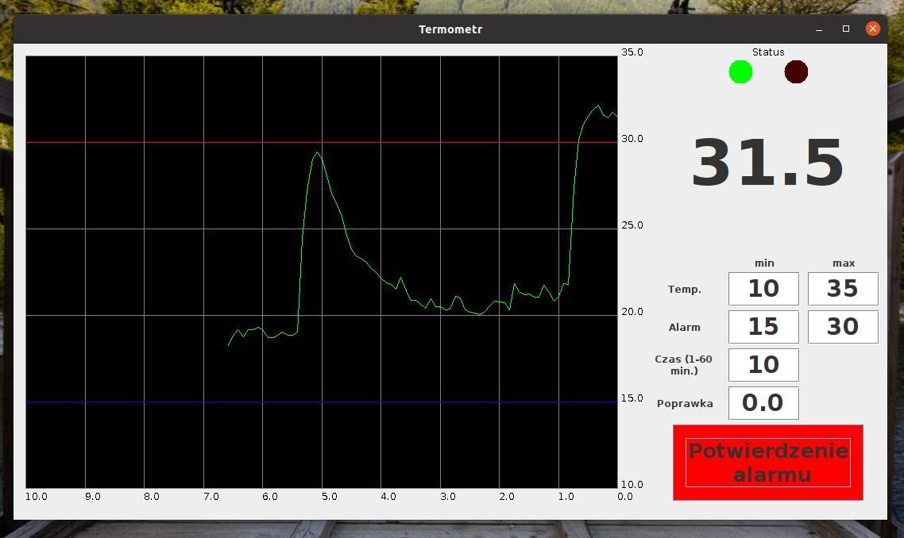
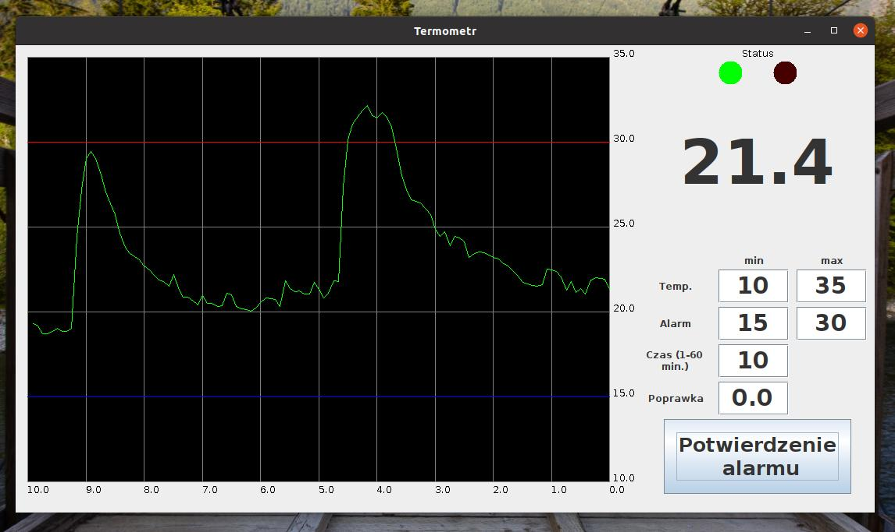
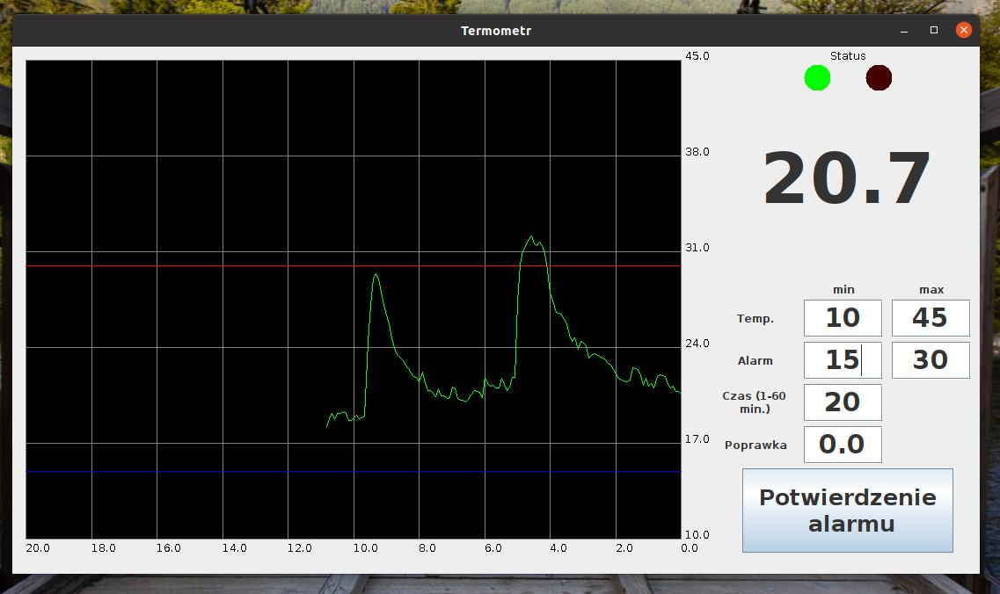

# Termometr
Aplikacja powstała w 2019 roku do odczytu danych z samodzielnie zbudowanego (w oparciu o układ ESP-WROOM-02) zdalnego termometru.

Program łączy się z termometrem o ip podawanym jako argument przy uruchamianiu programu na porcie 8000.
Wyświetla temperaturę w formie wykresu oraz informuje wizualnie i akustycznie jeśli pomiar wyjdzie poza podany zakres lub sygnał z termometru zniknie na dłużej niż minutę.

Po potwierdzeniu alarmu sygnał dźwiękowy jest wyłączany. Alarm resetuje się po powrocie temperatury do normy

Zakres wykresu oraz alarmu można regulować na bierząco

